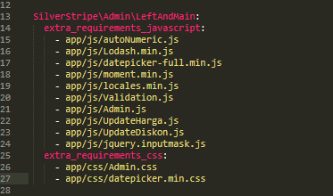
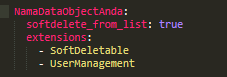
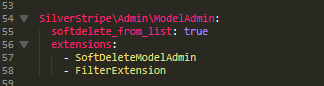
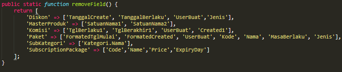
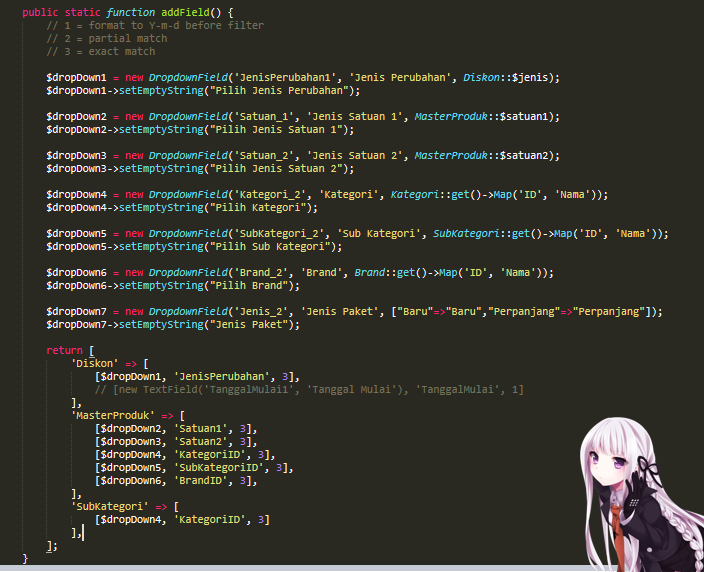
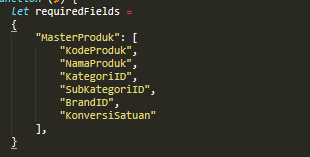
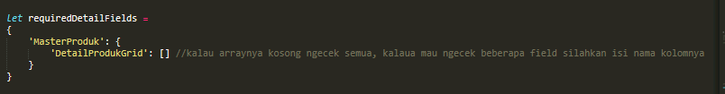

# Saya Tidak Tahu Ini Harus Dikasih Judul Apa
Ditulis berdasarkan pengalaman pribadi

## Beberapa Tip Untuk Anda Yang Bekerja Di Backend
### Persiapan project
- Copy folder extensi yang ada di C:/sharedfolder/didin ke folder_project_anda/app/src
- Copy folder js yang ada di C:/sharedfolder/didin ke folder_project_anda/app
- Copy folder css yang ada di C:/sharedfolder/didin ke folder_project_anda/app
- Instal silvertripe softdeletable pakai composer
- Buka File folder_project_anda/app/_config/mysite.yml lalu tambahkan text ini
  
  
  

### Tambah dan Hilangkan Filter
- Buka folder_project_anda/app/src/extensi/FilterExtension.php
- Ubah fungsi ini jika anda ingin menghilangkan beberapa filter. Isi key dengan nama DataObject anda dan value dengan nama field yang akan dihilangkan
  
- Ubah fungsi ini jika anda ingin menambahkan beberapa filter. Isi key dengan nama DataObject anda dan value dengan field yang akan diisi (note: pastikan nama fieldnya unik)
  

###  Required Form
- Buka folder_project_anda/app/js/Validation.js
- Untuk form utama ubah varibel ini. Isi key dengan nama DataObject anda dan value dengan nama field yang required
  
- Untuk detail ubah variabel ini. Isi key dengan nama DataObject anda dan value dengan nama grid field yang juga punya value array
  